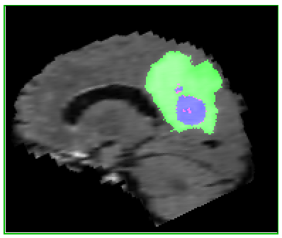
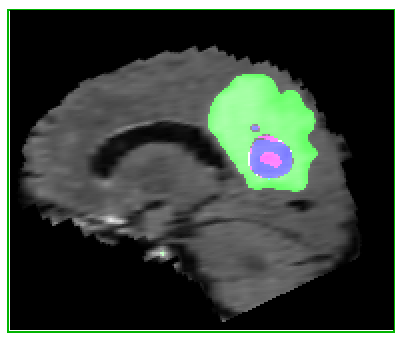

# Brain-Tumor-Segmentation-3D-UNet-CNN
Brain tumor segmentation using a 3D UNet CNN

I used Keras with a Tensorflow backend. This UNet was built for the MICCAI BraTS dataset: https://www.med.upenn.edu/sbia/brats2018/data.html

I achieved a dice score of 0.78 and weighted dice score of 0.67. I treated both tumor types (LGG and HGG) together. Papers that separate the task for each tumor subtype can perform better with respect to these scores.

Ground Truth:               |  Prediction:
:-------------------------:|:-------------------------:
  |  

The UNet was based on this paper: https://arxiv.org/abs/1802.10508 

My presentation for this work is here: [talk](./Brain_Tumor_Segmentation_Talk.pptx)

To do:
- Clean code
- Add alternative versions for 8xGPU
- Add alternative versions for on-the-fly image cropping versus pulling from pre-cropped pickle files

I heavily modified code from two sources to get this project to work:

- Original code for building the UNet was from this repo: https://github.com/ellisdg/3DUnetCNN
- Original code for the data generator: https://stanford.edu/~shervine/blog/keras-how-to-generate-data-on-the-fly.html
